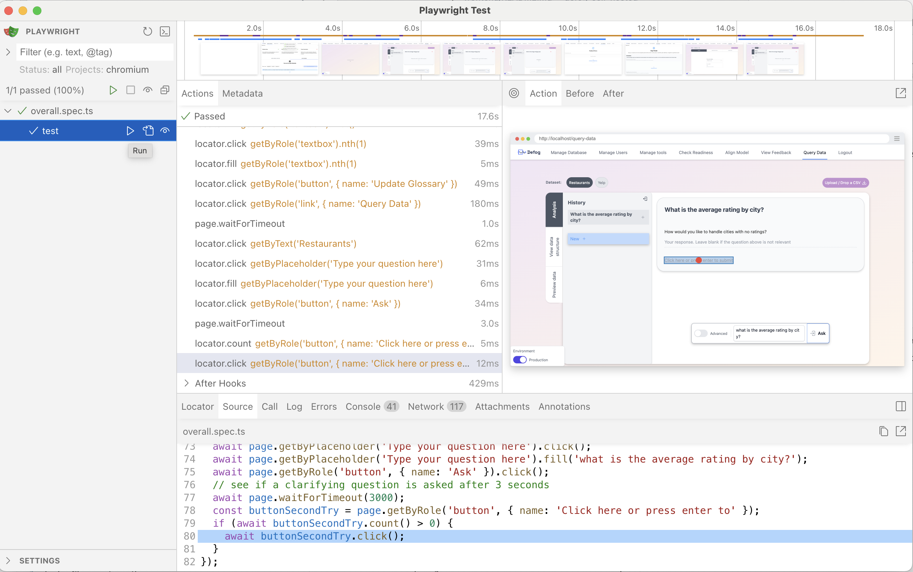

# The Defog Frontend

## Installing Dependencies

Run `npm i` to install all dependencies

## Environment Variables

Create a `.env.local` (using `.env.template` as a reference) in the `frontend` directory, taking care to ensure that the value of `NEXT_PUBLIC_API_KEY_NAMES` matches the value of `DEFOG_API_KEY_NAMES` in `.env.local` used by `docker-compose.yaml` in the root directory. `NEXT_PUBLIC_API_KEY_NAMES`'s value is used in some front-end components to determine which API keys to display, and is used to make requests to the backend.

## Exporting to static website

Run `npm run export` to export this to a static website.

## Developing locally

Run `npm run dev` to develop the app locally.

## How It Works
The frontend contains Javascript, CSS, and HTML files that provide a browser interface to interact with our backend. It is built with React, NextJS, and Tailwind.

There are two ways we use the frontend:

**1. In Production**
When we ship Defog to a customer, they access both the frontend and the backend from the same http server and port, via Nginx. For this to happen, we need to export the entire frontend as a static HTML, Javascript, and CSS resources that can be served directly via Nginx. After running `npm run export`, you can spin up the docker container and the frontend will be served at `localhost` (can omit the ports for http/https requests when putting into the browser).

**2. In Development**
When developing locally, we want to iteratively make changes while having the frontend app respond in close to real time to those changes. To this end, we do not want to export every single time.

Instead, we can just use `npm run dev` to develop the app iteratively. This will spin up a node server at `localhost:1236` that will serve the frontend app. This server will automatically reload the app when changes are made to the code.

## Testing

We use `playwright` for running end-to-end tests. With playwright, we can record our tests in a UI and then run them. If you have not installed `playwright` yet, you must run `npm run i` first.

### Running a test
To run a test, go to the `frontend` directory. Then run `npx playwright test --ui`. Once you do, a UI will open up.

In this UI, click on the "play" button next to the test you want to run. That's it! You can then see the tests being automatically run in the UI.

Note that tests can sometimes fail for no real reason. If that happens, just run it again.

### Recording a test
To record a test, install the [Playwright extension for VS Code](https://playwright.dev/docs/getting-started-vscode).

Once installed, you will see a "Testing" icon on the left, in the same place as where the Copilot chat icon resides.

You can then click on the Testing icon, and record a test in the UI using the instructions [here](https://playwright.dev/docs/getting-started-vscode#record-a-new-test).

Once done, a new test will be created in the `tests` folder. You can then modify it manually as needed.